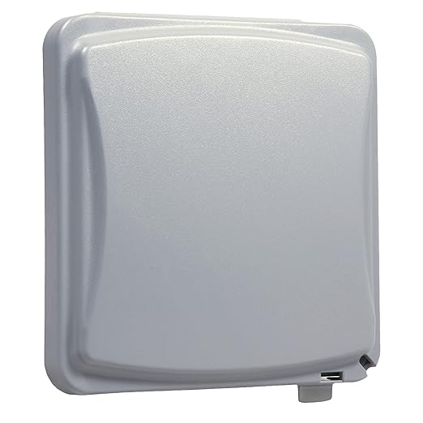
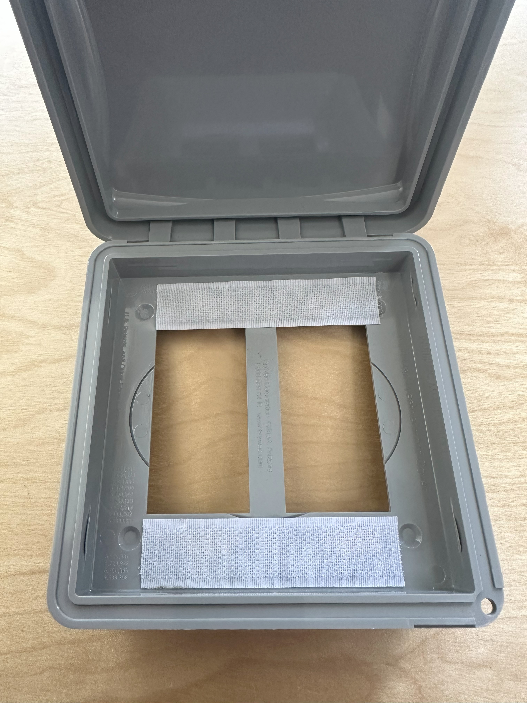
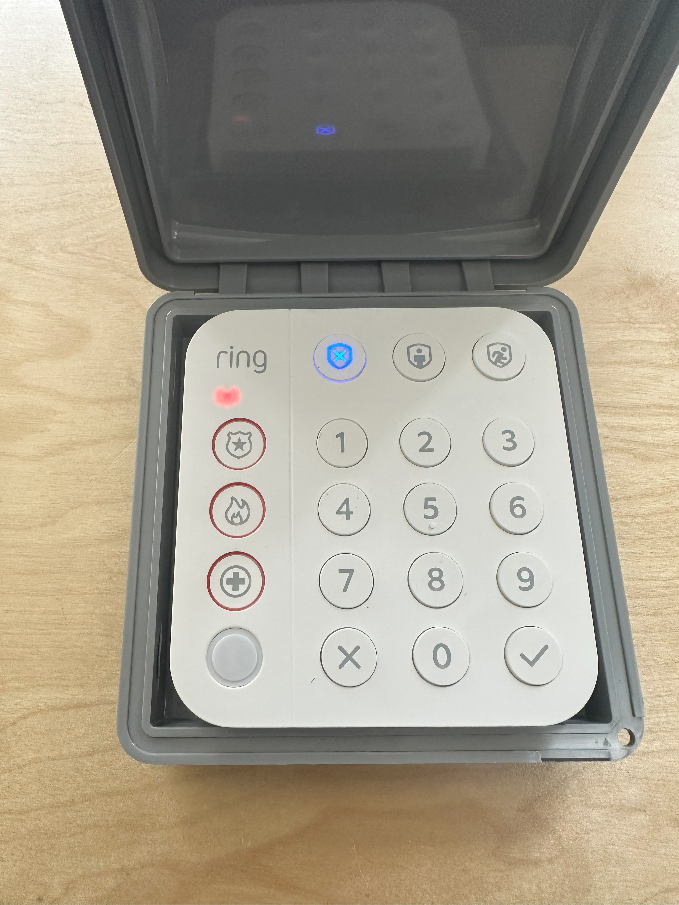

# Ring Keypad Blueprints for Home Assistant

Home Assistant blueprints to easily configure a Ring Keypad V2 as an external keypad for operating your garage door, or controlling the Alarmo integeation using user-codes managed by Keymaster. 

*These blueprints were derived from the great work by [@imsorrybutwho](https://github.com/ImSorryButWho/HomeAssistantNotes) for Ring keypads with the Alarmo integration.  

### Keypad Performance
* By default the motion detector in the keypad has a reset timer of two seconds, which can cause it to flood the zwave network and make the keypad appear to have connection issues.  To address this you need  to go to the device page and update the configuration for parameter 26 Motion Sensor Timeout with a larger number (e.g. 30). 
* For the best connection, you'll want the keypad connected directly to the controller rather than hopping through other zwave relays (if possible). 

## Alarmo + Keymaster Blueprint
**Alarmo keypad with Keymaster** - Instead of having to manage two sets of codes for users in Alarmo and Keymaster, this blueprint will validate any code input events on the keypad against active Keyaster codes before executing the desired alarm action. 

 

 
## Garage Door Opener Blueprints
  
1) **Garage Door Keypad with Keymaster** - This Blueprint will validate the codes entered into the keypad against those of your Keymaster codes that are currently active. Learn more about [KeyMaster](https://github.com/FutureTense/keymaster) here.

   

3) **Garage Door Keypad with String Codes** - This Blueprint allows you to provide a string of code combinations for the keypad to validate against. If you don't use Keymaster and want to just provide a few codes for the opener, you can do that here.

   

## Keypad Mounting
WIth the help of some velcro, minus the back plate, the keypad fits perfectly inside of [this dual-gang weather proof cover](https://www.amazon.com/gp/product/B001JEPX5I), for $9.00 on Amazon. 

 

