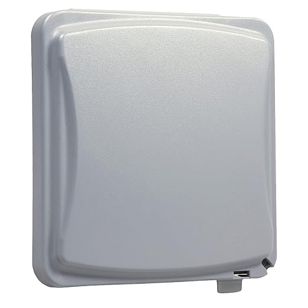
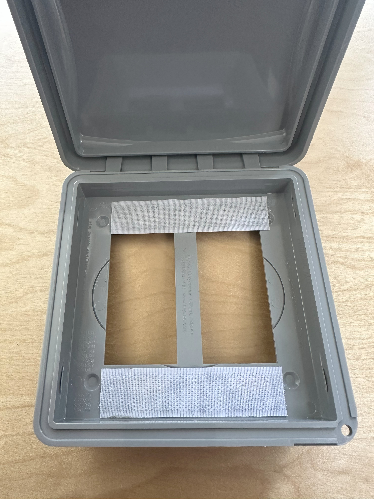
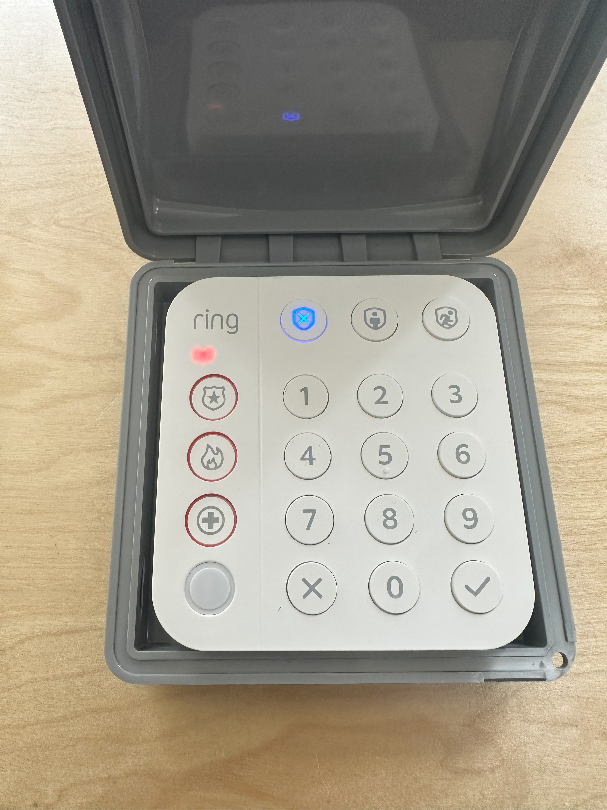

# Keymaster & Keypad Blueprints for Home Assistant

Home Assistant blueprints to use [KeyMaster](https://github.com/FutureTense/keymaster) codes with [Alarmo](https://github.com/nielsfaber/alarmo), either entered via dashboard cards or a physical Ring Keypad V2. Also includes a blueprint to use the Ring Keypad v2 as garage door open using Keymaster or user provided codes.

*These blueprints were derived from the great work by [@imsorrybutwho](https://github.com/ImSorryButWho/HomeAssistantNotes) for Ring keypads with the Alarmo integration.  

## Alarmo with Keymaster codes
Instead of having to manage two sets of codes for users in Alarmo and Keymaster, these blueprints will validate any code input events on the digital or physical keypads against active Keyaster codes before executing the desired alarm action.

1) **For Dashboard Alarm-Keypad cards** - This blueprint allows you to use Keymaster codes entered with the [custom:Alarmo card](https://github.com/nielsfaber/alarmo-card), to control your Alarmo control panel. Currently this only supports the Alarmo integration and the custom Alarmo card, but support for the standard HA Alarm and default alarm cards will be added in the future.
   
   * Supports all Alarmo modes
   * Logs the Code Slot # and the Alarmo alarm action to Logbook, to allow tracking of which users executed Alarm actions. 

      
 
 
2) **For Ring Keypad V2** - This blueprint allows you to use Keymaster codes enetered through a Ring Keypad V2, to control your Alarmo control panel. 
Currently this only supports the Alarmo integration, but support for the standard HA Alarm will be added in the future.

   * Supports Amred_Home, Armed_Away, Disarm
   * Keypad will play it's included sound clips for Alarm behaviors
   * Error tone and keypad flash on invalid code entry

       

 
## Ring Keypad Garage Door Opener
 
**Garage Door Keypad with Keymaster or User Provided Codes** - This Blueprint will validate the codes entered into the keypad against those of your Keymaster codes that are currently active, or against a string of codes you provide (if no Keymaster code sensors are detected). Learn more about [KeyMaster](https://github.com/FutureTense/keymaster) here.

   * Error tone and keypad flash on invalid code entry

      

### Ring Keypad Performance
* By default the motion detector in the keypad has a reset timer of two seconds, which can cause it to flood the zwave network and make the keypad appear to have connection issues.  To address this you need  to go to the device page and update the configuration for parameter 26 Motion Sensor Timeout with a larger number (e.g. 30). 
* For the best connection, you'll want the keypad connected directly to the controller rather than hopping through other zwave relays (if possible). 

### Keypad Mounting
WIth the help of some velcro, minus the back plate, the keypad fits perfectly inside of [this dual-gang weather proof cover](https://www.amazon.com/gp/product/B001JEPX5I), for $9.00 on Amazon. 

 

