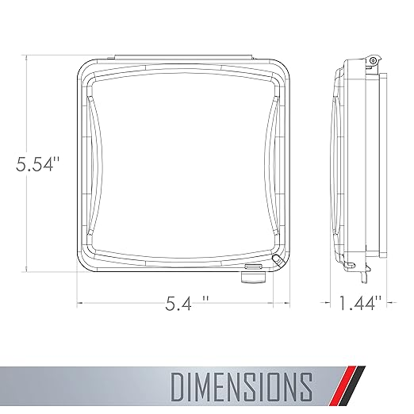

# Ring Keypad as Garage Door Keypad

Home Assistant blueprints to easily configure a Ring Keypad V2 as an external keypad for operating your garage door. 
There are two flavors:
1) Keymaster - This Blueprint will validte the codes enetered into the keypad against those of your Keymaster codes that are currently active. Learn more about [KeyMaster](https://github.com/FutureTense/keymaster) here.  
2) String - This Blueprint allows you to provide a string of code combinations for the keypad to validate against. If you don't use Keymaster and want to just provide a few codes for the opener, you can do that here.

## Features
* Toggles any cover (e.g. garage door) when a valid code is provided
* Choose which button/s toggle the cover after valid code entry (e.g Disarm button opens door #1, Armed Home buttom opens door #2)
* Can use existing users and codes from Keymaster
* Can be configured multiple times to control multiple garage doors
* Create your own custom actions for Fire, Police, Medical buttons (must be held for three seconds)

## Prerequisites
1. A Ring Keypad V2 connected via Z-wave to Home Assistant
2. A cover that you want to control.

## Installation

The easiest way to install is through HACS by adding this as a custom repository. 

1. In Home Assistant, select HACS -> Integrations -> (three dots upper-right) > Add Custom Repositry https://github.com/Fiercefish1/Zigbee-Lock-Manager/
2. Find Zigbee Lock Manager in HACS
3. Download the latest version
4. Restart Home Assistant
5. Set up and configure the integration  

## Manual Installation

Copy the `RingKeypad_GarageDoorOpener/GarageDoorKeypad_Keymaster.yaml` or `RingKeypad_GarageDoorOpener/GarageDoorKeypad_String.yaml` blueprint YAML file to your `blueprints/automation` directory. Reload All YAML from Developer Tools, and the blueprint should be available from the Automations > Blueprints page.

## Keypad Mounting
WIth the help of some velcro, minus the back plate, the keypad fits perfectly inside of [this dual-gang weather proof cover](https://www.amazon.com/gp/product/B001JEPX5I) (B001JEPX5I | $9 on Amzn). 

